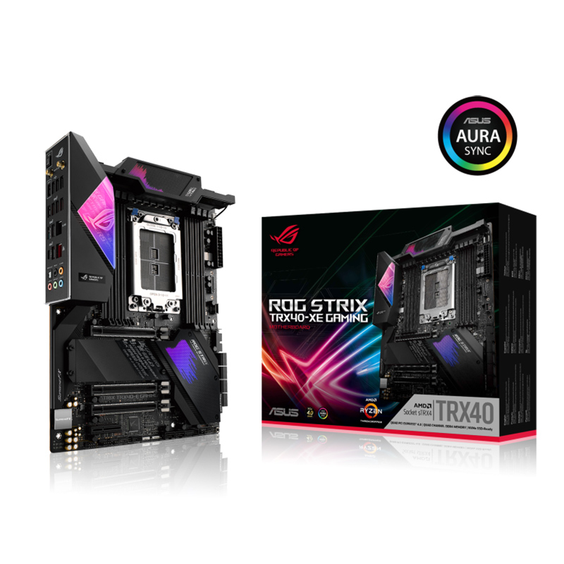

# Hackintosh: ASUS ROG Strix TRX40-E Gaming + AMD Threadripper 3960X

**macOS Sequoia 15.5**  
**SMBIOS Model: MacPro7,1**
**OpenCore Version: 1.0.4**

---

## Overview

This project documents the installation and configuration of macOS on a high-performance AMD Threadripper platform, using the ASUS ROG Strix TRX40-E Gaming motherboard and an AMD Radeon RX 6700 XT GPU. The goal is to achieve a fully functional system for creative tasks (audio, video, design) with support for most macOS peripherals and features.

> **Note:** This system is not recommended for software development requiring advanced virtualization (Docker, Xcode, Hyper-V, Android Studio, etc.), as the AMD architecture and lack of native Hyper-V support limit these capabilities.

---

## Compatibility Status

| Feature / Device              | Status      | Notes                                                        |
|------------------------------|-------------|--------------------------------------------------------------|
| Sleep                        | ✅ Works    |                                                              |
| AirDrop                      | ✅ Works    |                                                              |
| iMessage                     | ✅ Works    |                                                              |
| USB                          | ✅ Works    | All ports active                                             |
| Audio                        | ✅ Works    | Includes HDMI and onboard audio                              |
| Bluetooth                    | ✅ Works    |                                                              |
| Wi-Fi                        | ✅ Works    | Intel AX200 and BCM94360 supported (patch required)          |
| Ethernet                     | ✅ Works    | Intel I211 and Realtek RTL8125 supported                     |
| HDMI                         | ✅ Works    |                                                              |
| Installation on NVMe Kingston| ✅ Works    |                                                              |
| Installation on Corsair MP400| ❌ Fails    | Freezes during installation, cannot mount required volumes    |

---

## Hardware Used

- **Motherboard:** ASUS ROG Strix TRX40-E Gaming (TRX40 Chipset)
- **CPU:** AMD Ryzen Threadripper 3960X (24 cores, Castle Peak)
- **GPU:** AMD Radeon RX 6700 XT 12GB (PCIe Slot 2)
- **RAM:** 96GB DDR4 2133MHz
- **Storage:**  
  - 2TB NVMe SSD Kingston SNV3S2000G (macOS installed here)
  - 1TB NVMe Corsair MP400 (not compatible for macOS installation)
  - 1TB Samsung SSD 870 QVO (SATA)
- **Network:**  
  - Intel I211 Gigabit Ethernet  
  - Realtek RTL8125 2.5GbE PCIe  
  - Intel Wi-Fi 6 AX200 160MHz (patch required)  
  - BCM94360 802.11ac Wireless (patch required, last PCIe slot)
- **Audio:**  
  - Realtek USB2.0 Audio  
  - AMD High Definition Audio (HDMI)
- **Other:**  
  - Integrated Intel Bluetooth  
  - Various AMD USB 3.1/3.2 controllers

---

## Unsupported Hardware

- **NVMe Corsair MP400:**  
  During macOS installation, the process stops around minute 12 and does not progress. The console reports that it is not possible to mount the necessary volumes to complete the installation.

---

## BIOS Configuration

In the `Bios` folder you will find:
- **osx-sucess-cfg_setting.txt:** Detailed list of all recommended BIOS options and their status.
- **BIOS Profile:** File to load directly into the BIOS from a USB drive.

**Key options:**
- Secure Boot: Disabled
- Above 4G Decoding: Enabled
- Re-Size BAR Support: Auto
- CSM: Disabled
- SATA Mode: AHCI
- XHCI Hand-off: Enabled
- SVM Mode: Enabled
- TPM: Firmware TPM (may need to be disabled for some installations)
- Fast Boot: Disabled

> **Recommendation:** Load the included BIOS profile to avoid errors and ensure compatibility.

---

## Installation

- There are two EFI folders: one for pre-installation and one for post-installation. Use the appropriate one according to your system state.
- Follow the motherboard manual to correctly connect devices and configure the BIOS.
- If you use Intel or BCM Wi-Fi cards, you must patch macOS with the `OpenCore-Patcher` app (see `Post Install` folder).

---

## Post-Installation

- Use the tools in the `Post Install` folder to monitor the system and apply necessary patches.
- It is essential to run `OpenCore-Patcher` to enable Wi-Fi and Bluetooth support for Intel and BCM cards.

---

## Resources

- [ROG Strix TRX40-E Gaming Manual (PDF)](Manual/ROG_Strix_TRX40-E_Gaming_Manual.pdf)
